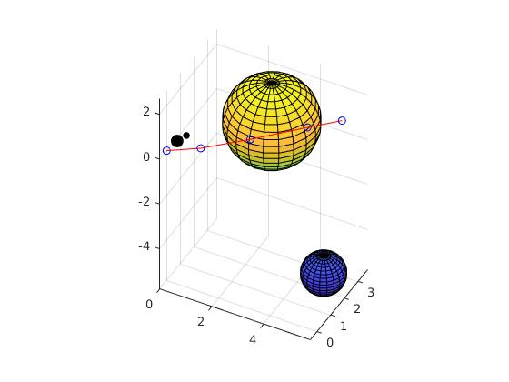

# Dynamic Optimization Homework 1
In this project we ([Ryan Brigden](https://github.com/rbrigden), [Shaurya Khazanchi](https://github.com/seyserkoze) and [Marcus Greer](https://github.com/marcusgreer)) tested various optimization algorithms to model the forward kinematics of a snake robot and solve an inverse kinematics problem using this model. We were tasked with finding the optimal joint angles that would place the end effector of the robot at a specified position and orientation in a cluttered environment. The base of the robot that we are modeling is bolted to the coordinate frame origin pointing along the global X axis, with the second axis aligned with the global Y (horizontal) axis and the third axis aligned with the global Z (vertical) axis. 

## Part 1
We first wrote a program that performs forward kinematics for a snake robot with variable number of links and link lengths. Provided a set of euler angles for each of the links (that encode the link’s roll, pitch and yaw with respect to the prior link) the forward kinematics routine positions the end effector at a position and orientation consistent with these euler angles and structural specificat. Functionally we iterate through the joints, and each joint is translated along the X-axis by the length of the previous link and then rotated with respect to the frame of the previous joint. This process rotates all of the downstream links so ultimately all the links and joints are rotated correctly with respect to the origin. We were able to use this program to easily the position of the end effector and its orientation given a set of euler angle parameters.

The inverse kinematics problem calls for finding the euler angle parameters for a given snake robot structure that optimize a set of soft constraints and meet another set of soft constraints. We formulate this as a constrained optimization problem and solve it using MATLAB’s fmincon, which by default uses the interior-point numerical optimization method.

Our soft constraints (cost functions) are

1. Euclidean distance from end-effector tip to the target position.
2. Quaternion difference between end effector and the target quaternion.
3. Sum of the euclidean distances from each link end to the closest point on the obstacle surface.

Note that the overall cost is a convex combination of these costs.

Our hard constraints are
1. Minimum angle value for all joints.
2. Maximum angle value for all joints.

Here is a sample solution of the above mentioned optimization problem. Note how the arm with 4 links reaches around the large obstacle, getting as close as it can to the target position and rotation while avoiding the obstacles.

Our program also identifies whether a provided robotic snake structure could possibly reach the target. If not, the program informs the user and performs the aforementioned optimization, which will find a solution that jointly minimizes the overall cost, which includes placing the tip as close as possible to the target.

## Part 2

We initially derived the analytical gradient of the position and obstacle cost. Our derivation can be found here: [INSERT]. We found the Jacobian of the effector position with respect to the euler angles using MATLAB’s symbolic toolkit. We were not able to derive an expression with respect to the quaternion distance.
We were unable to debug issues we had with MATLAB to provide the cost function gradient to fmincon. We were able to use the Pytorch auto-differentiation library to compute the gradient, but the only optimization function available to us in Python was (stochastic) gradient descent. We have provided this code as in the [INSERT] directory.
We would expect that providing the analytic gradient would result in much faster optimization because the algorithm could skip computing a gradient estimate numerically, which scales in time proportional to the cost of the forward model. Although forward computation for the small snake robot is rather cheap (a 3x3 matrix multiplication and vector addition for each link), one could imagine for a more complex robotic system that providing the analytic gradient is necessary for efficient optimization.
In terms of finding better solutions, which in this context as achieving a lower overall cost while remaining within the bounds of the hard constraints, it is not necessarily clear whether using the analytical gradient will achieve this over numerical methods. For non-convex objective surfaces it is certain that the analytic gradient can reach different local minima than numerical methods from the same starting point, but it can’t be ascertained beforehand which of these local minima are better than the other. In fact, a point raised by the professor in class is that numerical methods may be able to step over bad local minima due to their approximation error of the true gradient (acts as a low pass filter). 

## Part 3

For part 3 we experimented with different optimization algorithms implemented in fmincon: SQP, interior-point (the fmincon default), and active set and observe how the computation time and results change. We were not able to test trust-region-reflective because of our issues providing the gradient of the overall objective to fmincon and CMA-ES due to external package install issues.

Below we present 5 sample optimization trials on the same objective for each of the algorithms we tested.

| Interior Point | Final Cost     | Num Iters    |   |   |
|----------------|----------------|--------------|---|---|
|                | -14.5348       | 81           |   |   |
|                | -9.1266        | 22           |   |   |
|                | -14.5348       | 91           |   |   |
|                | -14.391        | 81           |   |   |
|                | -14.5348       | 83           |   |   |
| Mean +/- Std   | -13.4244 +/- 2.4 | 71.6 +/- 28.03 |   |   |

| Active Set   | Final Cost        |   Num Iters            |   |   |
|--------------|-------------------|---------------|---|---|
|              | -14.5348          | 33
|              | -14.391           | 26            |   |   |
|              | -13.5304          | 30            |   |   |
|              | -14.351           | 41            |   |   |
|              | -13.53            | 27            |   |   |
| Mean +/- Std | -14.0674 +/- 0.4952 | 31.4 +/- 6.0249 |   |   |
|              |                   |               |   |   |

| SQP          |   Final Cost   |  Num Iters         |   |   |
|--------------|----------------|-------------|---|---|
|              | -14.3526       | 37          |   | 
|              | -13.5304       | 43          |   |   |
|              | -14.391        | 30          |   |   |
|              | -14.534        | 40          |   |   |
|              | -14.391        | 33          |   |   |
| Mean +/- Std | -14.2398 +/- 0.4 | 36.6 +/- 5.22 |   |   |
|              |                |             |   |   |

It appears that SQP tends to find slightly better solutions on average than both Interior Point and Active Set, although Active Set reaches a solution more quickly and with comparable results. Both SQP and Active Set reach solutions more quickly than Interior Point.

## Part 4
Finally, we were tasked with finding multiple distinct local minima, and providing the user with a choice of local minima. We did so by probing different starting points (through random parameter initialization), running the optimization, and then sorting the final cost value for each solution in increasing order. The user would most likely choose the solution with minimum cost, but it is possible that the user holds preferences for solutions that are near the “best” solution, but meet some other criterion that wasn’t explicitly encoded in the cost. For example, one might want to select a next-best (with respect to the cost) solution that looks more like how a real snake would position itself around obstacles.

